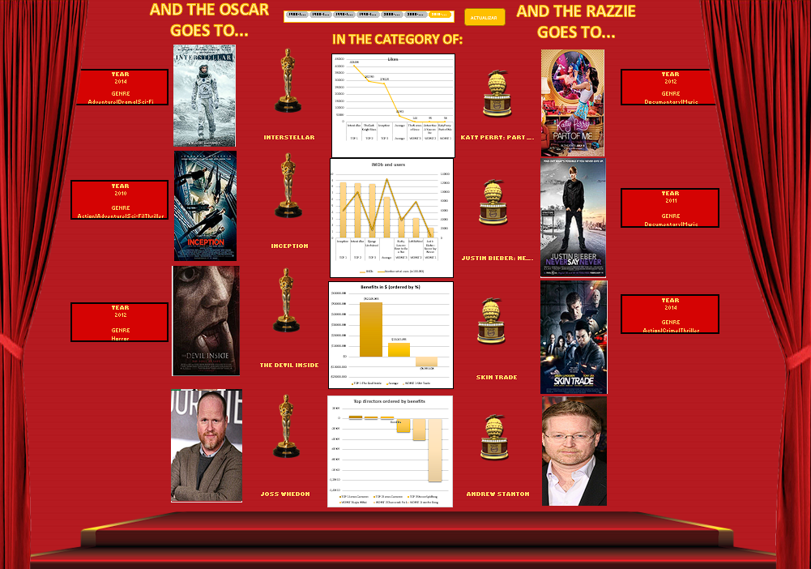

# Excel Dashboard Project: Learning Excel Formulas and VBA

## Project Overview
The goal of this project was to effectively learn and apply Excel formulas and VBA while creating a user-friendly, interactive dashboard. The project consists of two main files:

1. **methology.xlsx**: A preparatory file outlining the methodology for the project.
2. **final_project_dashboard.xlsm**: The final interactive dashboard simulating the Oscars and Razzies divided by lustrums.

## Files Included

### 1. methology.xlsx
This file was created before starting the project to outline the plan for building an advanced dashboard in Excel. It contains two sheets:

- **movie_metadata**: 
  - The first two columns include the initial names considered for the study and their descriptions.
  - The rest of the sheet contains the entire dataset used for the dashboard.

- **metodology**:
  - This sheet details the methodology followed in the creation of the dashboard, from data cleaning to the final visualization.

### 2. final_project_dashboard.xlsm
This is the final product, an interactive Excel dashboard simulating the Oscars and Razzies divided by lustrums. The file contains the following sheets:

- **Dashboard**:
  - The main dashboard, which may load slowly depending on your computer's performance.
  - A VBA button was added to upload the dataset in case new data needs to be included.
  - 
  - 

- **Data**:
  - Contains the formatted columns used in the final dataset.
  - A button is included to enter new data through a VBA-created form.

- **Likes, IMDb, Benefits, Director**:
  - These sheets contain pivot tables that enhance the interactivity of the dashboard.

- **Photos**:
  - This sheet stores images of the films and directors nominated throughout all the lustrums.

## How to Use
1. **Download the files** from the repository.
2. **Open `final_project_dashboard.xlsm`** to interact with the dashboard.
3. **Ensure macros are enabled** to utilize the VBA functionalities, including the data upload button and form entry.

## Learning Outcomes
- Mastery of advanced Excel formulas.
- Hands-on experience with Excel VBA for automation and interactivity.
- Creation of a comprehensive and user-friendly dashboard.
